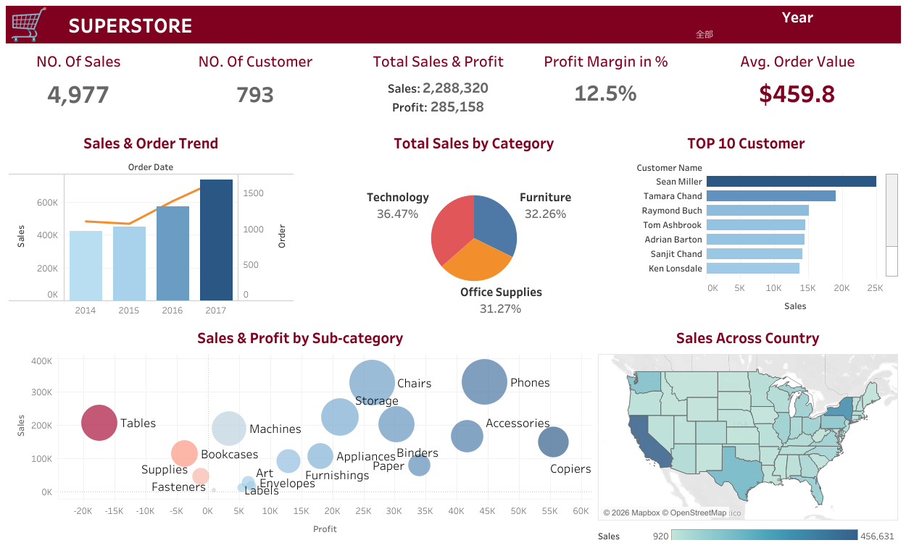
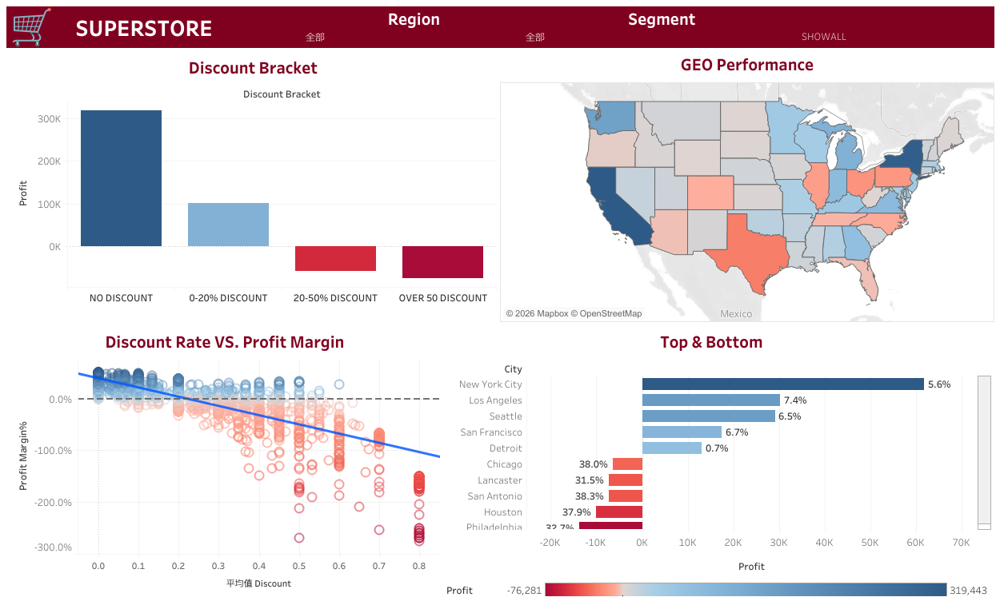
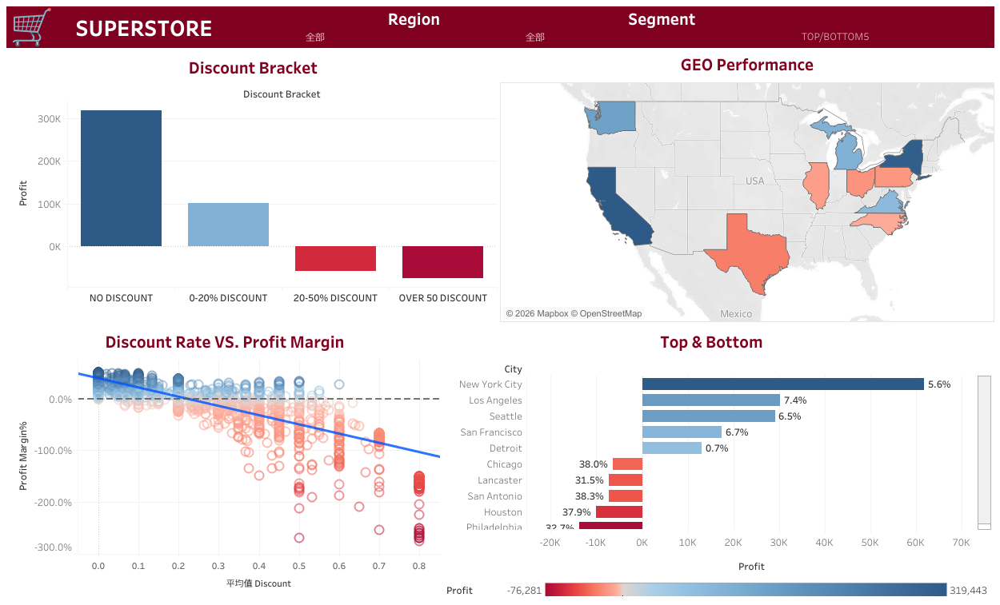
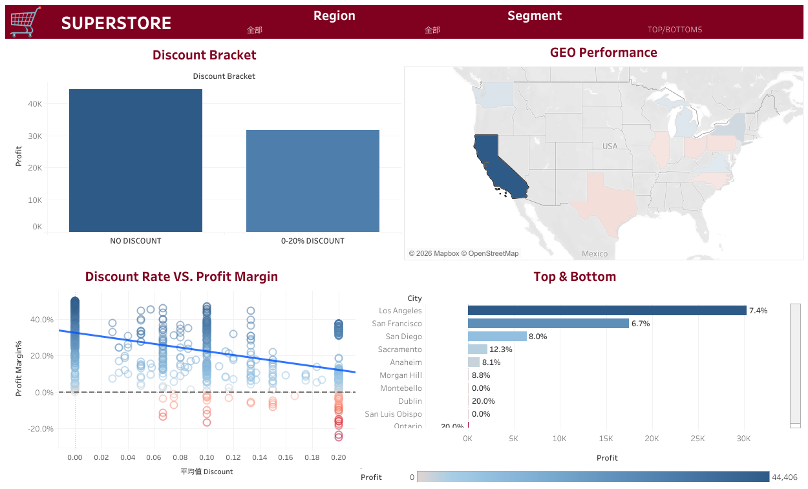
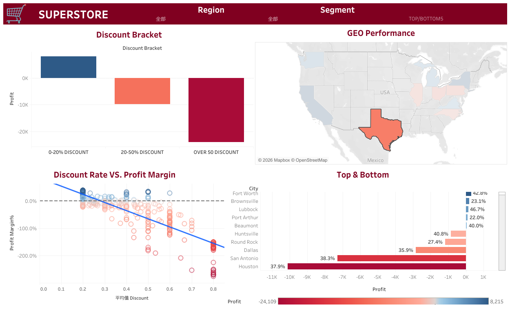

# Tableau Dashboard SuperStore Performance

## Project Overview
  This project analyzes the **"Superstore Dataset"** (5,000 orders, 2014–2017) using **Tableau** to identify growth drivers and profitability leaks. The goal is to evaluate sales trends and provide actionable strategies for profit improvement.

## Highlights

---

  
Click to view Dashboard

   
  
  #### SuperStore Overview Dashboard
  

  #### Sales and Profit Dashboard
  

  #### Sales and Profit Dashboard TopBottom Fitter ON
  

  #### Sales and Profit Dashboard TopState
  

  #### Sales and Profit Dashboard BottomState
  

---

### 📂 Quick Links
* [**Read Final Report (PDF)**](./SuperStore_Analysis_Report.pdf)
* [**Full SuperStore Dashboard (TWBX)**](./SuperStore_Analysis_Full_Project.twbx)
* [**Raw Dataset (CSV)**](./Sample_Superstore_final.csv)
